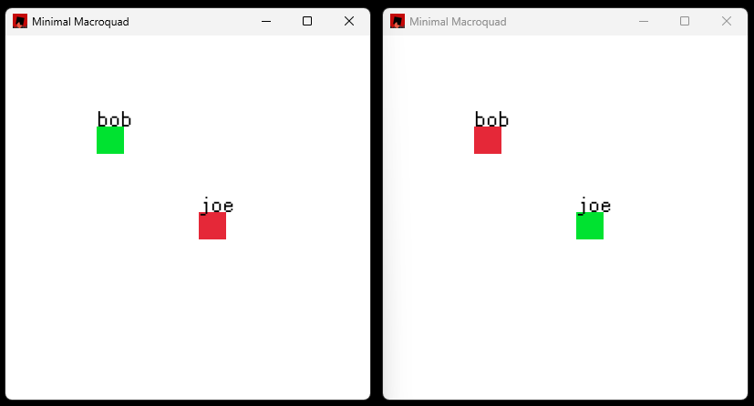

# Minimal Macroquad

The most basic multiplayer interaction using the [`macroquad` crate](https://www.crates.io/crates/macroquad).

## Screenshot

## How-To

Make sure this project has a file `auth.key` at its root. This is used for <b>BUMMER</b> HTTP requests (room handling).

`echo abc123 > auth.key`

In one instance, run:

`cargo run -- --name bob --host`

In another instance, run:

`cargo run -- --name joe`

Move around the windows as needed for testing. Take turns clicking into each window, and use WASD to move.