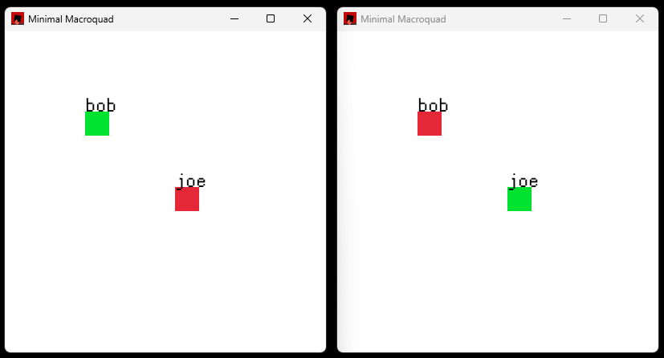

# Minimal Macroquad

The most basic multiplayer interaction using the [`macroquad` crate](https://www.crates.io/crates/macroquad).

## Screenshot

## How-To

Make sure this project has a file `auth.key` at its root. This is used for <b>BUMMER</b> HTTP requests (room handling).

`echo abc123 > auth.key`

To solely host the server, run:

`cargo run -- --host`

Users can then join like this:

`cargo run -- --room test --name tester`

To both host the server and spawn a client, run:
`cargo run -- --room test --name tester --host`

Move around the windows as needed for testing. Take turns clicking into each window, and use WASD to move.
